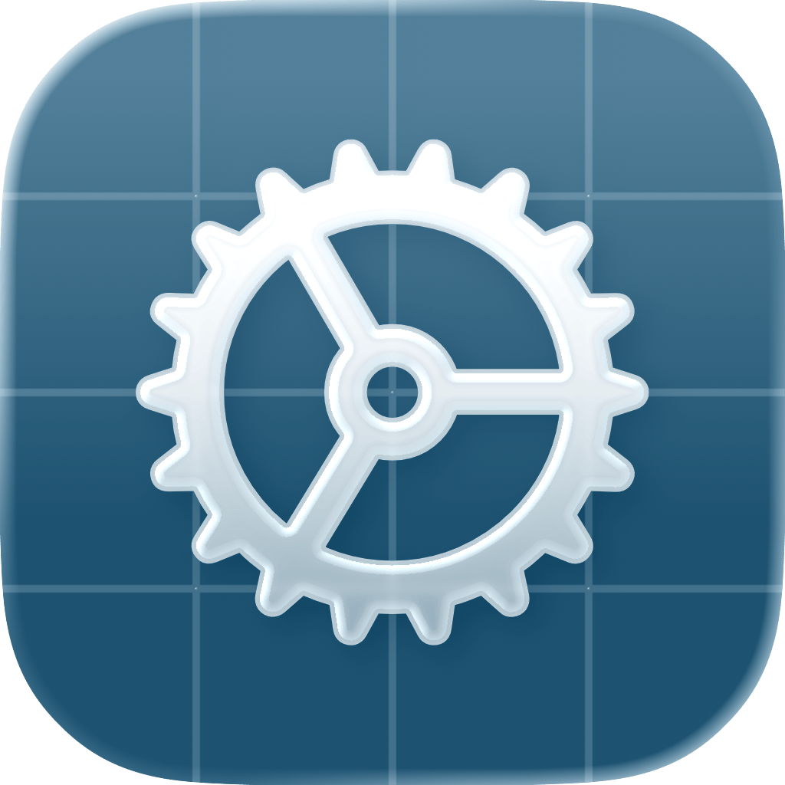

<div>
  <h1>SettingsKit </h1>
  <p>Build settings pages that users can navigate and search while interacting with your app’s live SwiftUI controls.</p>
  <p>     </p>
</div>

## Features

- Organize settings into navigation pages, inline sections, and custom destinations.
- Search titles and tags, with matching controls retaining their live bindings.
- Use built-in sidebar and single-column interfaces or supply your own navigation and layout.
- Style complete presentations or individual groups independently.
- Exclude groups from search while keeping them available through normal navigation.


## Installation

Add SettingsKit through Xcode’s package dependencies, or declare it in `Package.swift`:

```swift
dependencies: [
    .package(url: "https://github.com/Aeastr/SettingsKit.git", from: "3.0.0")
]
```

Link the `SettingsKit` product to your app target. For a Swift package target, add `.product(name: "SettingsKit", package: "SettingsKit")` to its dependencies.

Upgrading from 2.x? Read the [version 3 migration guide](Sources/SettingsKit/SettingsKit.docc/Essentials/MigratingToVersion3.md) and [release notes](https://github.com/Aeastr/SettingsKit/releases/tag/3.0.0). Version 3 changes public styling, icon, and metadata APIs.

## Quick Start

Define a settings container, then mount it where your app displays settings:

```swift
import SettingsKit
import SwiftUI

struct AppSettings: SettingsContainer {
    @State private var notificationsEnabled = true
    @State private var displayName = "Guest"

    var settingsBody: some SettingsContent {
        SettingsGroup("General") {
            Toggle("Notifications", isOn: $notificationsEnabled)
                .indexed("Notifications", tags: ["alerts"])
            TextField("Display Name", text: $displayName)
                .indexed("Display Name")
        }
    }
}

struct SettingsScreen: View {
    var body: some View {
        AppSettings()
    }
}
```

`SettingsContainer` supplies the built-in settings interface. Group titles are searchable; individual controls opt in with `.indexed(...)`. Search results display the live controls bound to the same values.

The example uses local view state. Your app owns settings models, persistence, validation, actions, and errors from those actions. Use your normal observable model, bindings, or persistent storage when values must survive the view’s lifetime. SettingsKit does not save them automatically.

## Choose a Presentation

Use a complete built-in interface or integrate SettingsKit into your existing shell:

| Approach | Use when |
| --- | --- |
| Default sidebar style | SettingsKit should provide the navigation and settings layout. |
| Single-column style | Settings should appear in one column using `Form`. |
| `SettingsStyle` | A reusable style should own container, navigation, and group presentation. |
| `SettingsHost` | Your app owns navigation, tabs, toolbars, and layout. |
| `SettingsGroupStyle` | Only group presentation should change inside an app-owned shell. |

For example, replace `AppSettings()` in `SettingsScreen.body` with:

```swift
AppSettings()
    .settingsStyle(.single(search: .destinations))
```

Built-in styles support `.root`, `.destinations`, `.all`, and `.none` search placement. Page searches use that destination’s hierarchy. On iOS 26 and later, destination search requests a compact native toolbar control; expansion and available width remain system-managed. [Presentation documentation](Sources/SettingsKit/SettingsKit.docc/Presentation/Presentation.md) covers custom shells, styling, and destination titles.

## Indexing and State

Use `.unindexed()` to exclude a group or indexed control and its descendants from search. It preserves normal navigation, identity, bindings, and styling. Exclusion overrides indexed children, including in page searches. Custom search implementations must respect excluded subtrees.

Each `SettingsHost` owns its search state, navigation, and live-view registry. SettingsKit builds its index when the host appears; changes to live values update controls without reindexing. If titles, tags, exclusions, or hierarchy change, update the container’s `settingsIndexRevision`. Keep transient values out of search tags and provide stable identities for same-named siblings.

See [Indexing and Search](Sources/SettingsKit/SettingsKit.docc/Search/IndexingAndSearch.md) for matching, identities, exclusions, and custom search behavior.

## Documentation

The [DocC catalog](Sources/SettingsKit/SettingsKit.docc/SettingsKit.md) combines task guides with the public API’s inline documentation. Build it through Xcode’s documentation tools to browse the rendered catalog.

- [Essentials](Sources/SettingsKit/SettingsKit.docc/Essentials/Essentials.md): getting started, the central model, and migration.
- [Composition](Sources/SettingsKit/SettingsKit.docc/Composition/Composition.md): groups, sections, custom content, and navigation.
- [Search](Sources/SettingsKit/SettingsKit.docc/Search/Search.md): indexing and interactive results.
- [Presentation](Sources/SettingsKit/SettingsKit.docc/Presentation/Presentation.md): built-in interfaces, custom layouts, styles, and introductory rows.
- [Architecture](Sources/SettingsKit/SettingsKit.docc/Architecture/Architecture.md): metadata, rendering, and macOS navigation state.

The `Demo` project includes built-in examples, custom destinations, a complete custom presentation, a tabbed cards layout, and diagnostics.

## Contributing

See [CONTRIBUTING.md](CONTRIBUTING.md) for issues, branch naming, pull requests, validation, and releases.

## License

MIT. See [LICENSE](LICENSE) for details.
